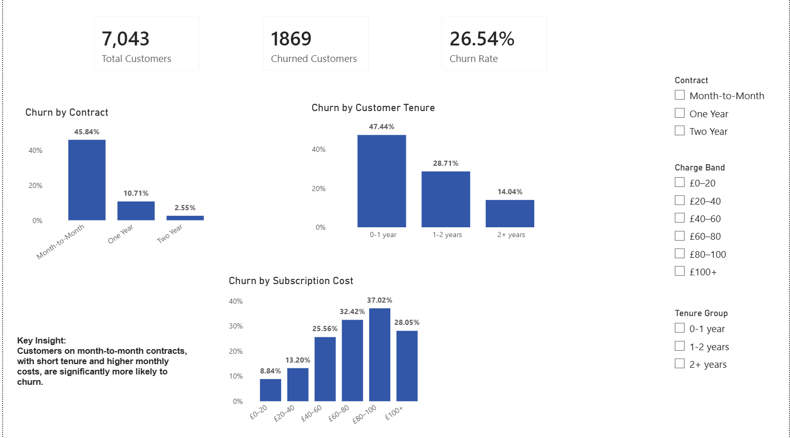

# Customer Loyalty Dashboard

## 📊 Overview
This project analyses customer churn in a telecommunications dataset, identifying key factors such as contract type, customer tenure, and monthly subscription cost that influence retention.

## 🎯 Business Question
What factors are driving customer loyalty, and which customer segments are most at risk? 

## 📁 Dataset
Telco customer churn dataset (Kaggle)

## 🧱 Data Model
Single fact table

## 📈 Key Metrics
- Churn Rate
- Total Customers
- Churned Customers

## 📊 Dashboard

## 🔍 Key Insights
- Customers on month-to-month contracts show significantly higher churn rates (~46%) compared to those on long-term contracts (~2–10%).
- New customers (0–1 year tenure) are at the highest risk of churn (~47%), indicating early-stage retention is critical.
- Customers with higher monthly subscription costs (particularly £60–£100) have significantly higher churn rates, suggesting price sensitivity among higher-paying segments.

### 💡 Recommendations

- Encourage longer-term contracts through incentives to reduce churn risk
- Improve onboarding and engagement for new customers within the first year
- Review pricing strategies or value offerings for higher-cost customers
	
## 🛠 Tools Used
- Power BI
- DAX

## 🐍 Python Analysis

A simple Python script was used to explore the dataset and validate churn patterns, including overall churn rate and churn distribution by contract type.

Location:
scripts/churn_analysis.py

## 🚀 What I Learned
- Applied DAX to calculate dynamic churn metrics
- Developed segmentation to identify churn drivers
- Built an insight-driven dashboard for business decision-making
