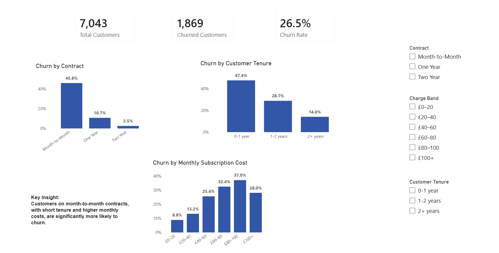

# Customer Churn Analysis – Microsoft Fabric

## 📊 Overview
This project rebuilds a customer churn analysis using Microsoft Fabric, demonstrating a modern end-to-end analytics architecture.

The solution integrates data ingestion, transformation, storage, and reporting within a unified cloud platform.

---

## 🎯 Objective
To redesign a traditional Power BI analysis using Microsoft Fabric, separating data preparation, storage, and reporting into distinct layers.

---

## 🧱 Architecture

- Data Source: OneDrive (SharePoint)
- Data Ingestion: Dataflow Gen2
- Data Storage: Fabric Lakehouse
- Semantic Model: Direct Lake
- Reporting: Power BI

---

## ⚙️ Data Pipeline

1. Source data stored in OneDrive
2. Dataflow Gen2 used to ingest and transform the dataset
3. Cleaned data loaded into a Fabric Lakehouse table
4. Semantic model automatically generated (Direct Lake)
5. Power BI used to create measures and visuals

---

## 🔧 Transformations (Dataflow Gen2)

- Created customer tenure groups
- Created monthly charge bands
- Standardised data types

All transformations were performed upstream in Power Query to ensure consistency and reuse.

---

## 📊 Dashboard

## 📈 Key Analysis

- Churn by Contract Type
- Churn by Customer Tenure
- Churn by Subscription Cost

---

## 🔍 Key Insights

- Customers on month-to-month contracts have significantly higher churn rates (~46%)
- New customers (0–1 year) are at the highest risk of churn (~47%)
- Higher monthly charges correlate with increased churn

---

## 🚀 Key Takeaways

- Built an end-to-end analytics pipeline using Microsoft Fabric
- Separated data transformation, storage, and reporting layers
- Used Direct Lake to connect Power BI directly to Lakehouse data
- Understood how semantic models are generated and used in Fabric

---

## 📌 Status
Work in progress – focused on building practical experience with Microsoft Fabric