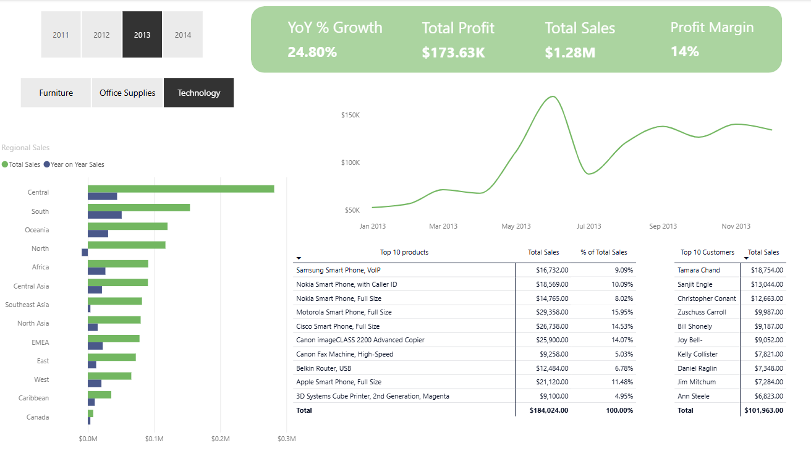

# Sales Analytics Dashboard

## 📊 Overview
This project analyses sales performance across regions, products, and time using Power BI.

## 🎯 Business Question
Which regions and products drive the most revenue and profitability?

## 📁 Dataset
Superstore Sales dataset (Kaggle)

## 🧱 Data Model
- Single fact table: Sales
- Date dimension created for time analysis

## 📈 Key Metrics
- Total Sales
- Total Profit
- Profit Margin

## 📊 Dashboard

## 🔍 Key Insights
- The Central region is the highest revenue contributor over time, while Technology and Office Supply products deliver the strongest profitability,
	indicating high value sectors for growth.
	
## 🛠 Tools Used
- Power BI
- DAX

## 🚀 What I Learned
- Refreshed Power BI data modelling skills
- Applied DAX for business metrics
- Built a clear, business-focused dashboard